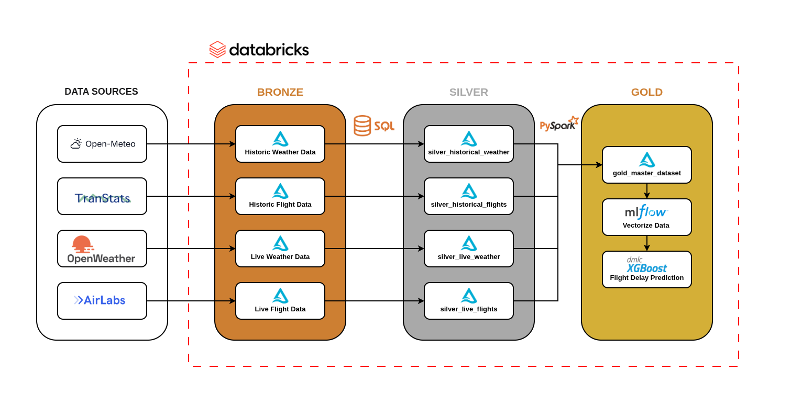
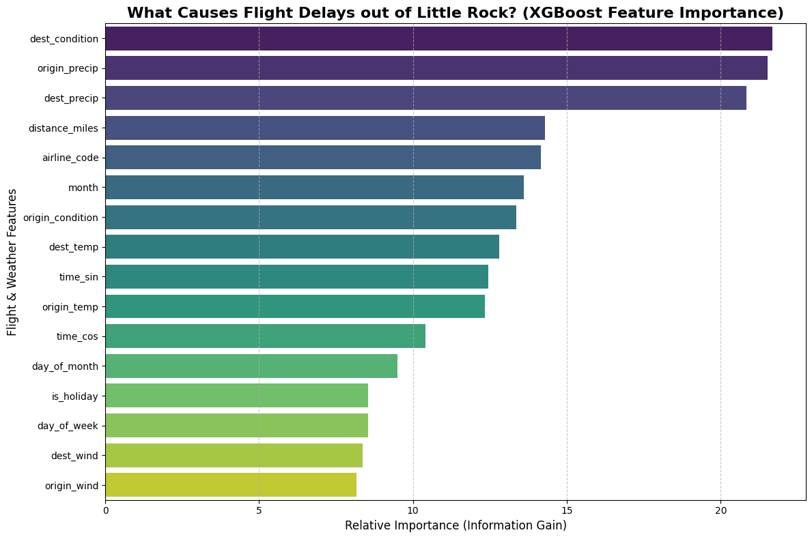
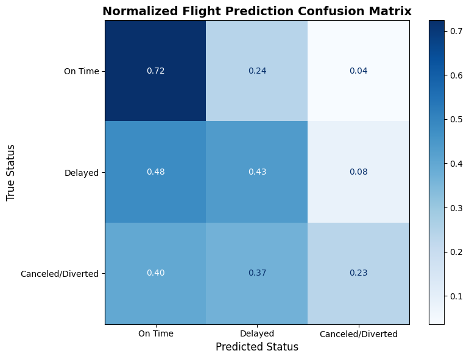

# Aviation Delay Prediction & Lakehouse Pipeline

## Business Overview
Flight delays and cancellations cost the aviation industry billions of dollars annually. This project is an end-to-end Data Engineering and Machine Learning pipeline designed to predict flight disruptions out of and in to Little Rock (LIT). 

Instead of relying on static CSVs, this project implements a **Medallion Lakehouse Architecture** (Bronze, Silver, Gold) on Databricks to automatically ingest, clean, and map historical flight telemetry with historical weather data. The resulting master dataset feeds an MLflow-governed XGBoost model capable of predicting future flight statuses based on live meteorological forecasts.

## 📐 System Architecture

This pipeline strictly adheres to the Medallion Architecture data design pattern:

* **🥉 Bronze Layer (Raw Ingestion):** * Extracts historical flight data (BTS) and weather data (Open-Meteo API).
    * Data is dumped in its raw, strictly-typed Parquet/Delta format to prevent schema drift.
* **🥈 Silver Layer (Cleansing & Conforming):** * Filters out anomalies (e.g., 2020-2021 COVID flight drops).
    * Resolves complex timezone collisions by standardizing local departure times to UTC.
    * Implements defensive string splitting and handles missing government routing data.
* **🥇 Gold Layer (Feature Engineering):** * Joins the weather and flight Delta tables on spatial-temporal keys.
    * Extracts cyclical time features (Sine/Cosine for time of day) and holiday flags.
    * Outputs a pristine, 34-feature matrix ready for ML consumption.

## 🧠 Machine Learning Engine (XGBoost + MLflow)

The inference engine utilizes a tuned **XGBoost Classifier** designed specifically to catch rare disruption events. 

* **Addressing Class Imbalance:** Since ~77% of flights are on time, the model utilizes Scikit-Learn's `compute_sample_weight` to mathematically penalize the algorithm for missing rare "Delayed" or "Canceled" flights. 
* **Enterprise MLOps:** The entire training loop is wrapped in **MLflow**. Every hyperparameter, accuracy metric, and model signature is automatically tracked, version-controlled, and saved securely to the Databricks MLflow UI.

### 📊 Visual Analytics

#### What drives flight delays?
Using XGBoost's native Information Gain metrics, we extracted the feature importance to understand exactly what causes disruptions. 

#### Model Evaluation

## 🚀 Live Inference Engine

The `11_Predict_Future_Flight.py` script acts as the production inference point. It accepts a flight number, origin, destination, and future date. 

**Under the hood, it:**
1.  Validates the date against a 14-day API guardrail.
2.  Queries the Silver Delta tables or calculates Haversine geodetic distance for the routing.
3.  Pings the Open-Meteo API to extract the exact forecasted weather for the departure and arrival airports at the scheduled time.
4.  Pulls the governed XGBoost model from MLflow to output a live probability matrix.

## 🛠️ How to Run

1. Clone this repository: git clone `https://github.com/selimhanemre/aviation-delay-ml-pipeline.git`
2. Import the notebooks into a Databricks environment (Community Edition or Enterprise).
3. Execute notebooks `01` through `09` sequentially to build the Delta Lake.
4. Run `10_XGBoost_MLflow_Training` to train and register the model.
5. Update the `RUN_ID` in notebook `11` and input your upcoming flight details to generate a live prediction.

**Sample Output:**

========================================

 FLIGHT FORECAST: AA3419 (LIT -> DFW)

 DATE: 2026-04-02 | TIME: 14:30

========================================

 ✅ On Time:           68.42%

 ⚠️ Delayed:           25.10%

 🚨 Canceled/Diverted: 6.48%

========================================

## 👨‍💻 Author

**Selimhan Dagtas** - [LinkedIn](https://www.linkedin.com/in/selimhan-dagtas/)